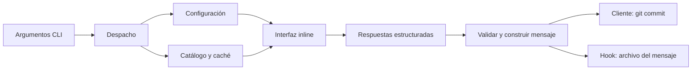

# Plan de migración de gitmoji-cli a Go

Fecha: 2026-10-06. Estado: fases 0, 1 y 2 completadas con verificación local Linux; configuración/catálogo e integración Git pendientes. Consultar [COMPATIBILITY](COMPATIBILITY.md) para contratos, [CLI](CLI.md) para el uso actual, [PROTOTYPE](PROTOTYPE.md) para la interfaz y MEMORY para progreso real.

Este documento conserva el contrato detallado y los criterios de salida del plan original. Consultar [CONTEXT](CONTEXT.md) para el vocabulario y las decisiones estables, [MEMORY](MEMORY.md) para el progreso real y [AGENTS](AGENTS.md) para las instrucciones de trabajo. Leer por secciones según la tarea.

## 1. Objetivo y decisiones de partida

Crear una herramienta distribuible como ejecutable nativo, sin dependencia de Node, npm, Yarn ni npx en su uso normal. Conservar una experiencia interactiva inline con búsqueda, navegación por teclado, validación y edición de mensajes; incorporar el estándar `tipo(alcance): descripción` de la imagen.

El proyecto adopta **Go**, **Huh** para formularios y **Bubble Tea/Bubbles** para el modelo reactivo y preview comprobados en fase 1. La implementación actual se detalla en MEMORY.

Decisiones iniciales:

- Mantener el nombre confirmado del ejecutable `gitmoji`, sus comandos y los alias útiles. Definir canales y versión nativa antes de publicar.
- Implementar los **tres modos solicitados**: emojis, estándar e híbrido con emojis clasificados por tipo de commit.
- Usar `standard` como modo predeterminado confirmado para instalaciones nuevas. Permitir elegir modo explícitamente y guardarlo en preferencias; importar perfiles heredados sin modo como `emoji` para conservar su comportamiento.
- Mantener Git como dependencia externa. Ejecutar el Git instalado en lugar de incorporar otra implementación de Git.
- Mantener JSON para configuración y caché. Leer un `package.json` existente no requiere Node ni obliga a incluirlo en la nueva distribución.
- Separar recopilación de respuestas, construcción del mensaje y efectos sobre Git o archivos.
- No introducir servicios, base de datos, sistema de plugins, arquitectura de interfaces ni TUI de pantalla completa sin una necesidad concreta.

## 2. Base observada y límites del reconocimiento

Los hechos siguientes se contrastaron mediante descargas selectivas de `carloscuesta/gitmoji-cli` v9.7.0, commit `c4b0e56adea61c9e279b18d16cd46a837dd4bd55`, durante fase 0. El checkout no contiene el árbol JS/TS; la tabla describe el upstream, no un inventario local. Fuentes y diferencias acordadas: COMPATIBILITY.

| Hecho observado | Consecuencia para la migración |
| --- | --- |
| `package.json` declara versión 9.7.0, ESM, Node >=18 y binario `lib/cli.js` | El ejecutable nativo reemplazará el artefacto publicado, no solo el código fuente |
| `src/cli.ts` y `src/commands/commit/withClient/index.ts` usan TypeScript; el resto mezcla JavaScript y Flow | No trasladar Babel, Flow ni TypeScript al proyecto Go |
| La CLI admite flags y nombres de comandos; carga comandos dinámicamente | Conservar la interfaz pública mediante una tabla de despacho pequeña |
| Los modos cliente y hook comparten prompts pero construyen el mensaje por separado | Unificar construcción y validación del mensaje antes de elegir destino |
| La caché está en `~/.gitmoji/gitmojis.json` | Mantener su lectura inicialmente y evitar pérdida de datos |
| La configuración se busca desde el directorio actual hacia los padres | Preservar y probar precedencia; no asumir una mezcla de todos los archivos |
| El hook utiliza `prepare-commit-msg`, bash, acceso a `/dev/tty` y npx cuando está disponible | Sustituir la invocación de Node y validar terminal y argumentos en cada plataforma |
| Hay pruebas Jest, snapshots y mocks globales de filesystem, Git, red y prompts | Reutilizar casos y datos, complementándolos con integración real en repositorios temporales |
| En el commit fijado, CI/release usan Node 18.x; release compila con Babel, publica npm y empaqueta con `pkg` | Reemplazar la distribución con herramientas Go; no introducir estos workflows en el checkout nativo |

La inspección fue de lectura. No se ejecutaron pruebas, builds ni benchmarks. Las rutas de `conf` se derivaron de sus fuentes fijadas; falta probar importación por plataforma, equivalencia visual de Huh con Inquirer y tamaño de los futuros binarios.

## 3. Estándar de commits: comportamiento del producto y del desarrollo

### 3.1 Tres modos de mensaje

El usuario ha confirmado que los tres modos forman parte de la primera versión, no de una extensión futura.

| Modo | Formato con alcance | Sin alcance | Selección |
| --- | --- | --- | --- |
| `emoji` | `✨ (usuarios): agregar búsqueda por dni` | `📝 actualizar documentación` | Emoji del catálogo completo; tipo no obligatorio |
| `standard` | `feat(usuarios): agregar búsqueda por dni` | `docs: actualizar documentación` | Uno de los seis tipos; emoji ausente del mensaje |
| `hybrid` | `feat(usuarios): ✨ agregar búsqueda por dni` | `docs: 📝 actualizar documentación` | Tipo y después emoji filtrado por ese tipo |

El modo emoji conserva la estructura gitmoji original y permite Unicode o shortcode mediante `emojiFormat`. El híbrido también respeta esa preferencia: por ejemplo, `feat(usuarios): :sparkles: agregar búsqueda por dni`. El modo estándar sigue exactamente el perfil de la imagen sin añadir emojis al título.

El usuario confirmó colocar el emoji híbrido después de `: ` para mantener reconocible el prefijo convencional. Este modo añade una decoración a la descripción y no se presenta como el modo estricto.

Usar una misma estructura de respuestas con modo, tipo cuando corresponde, emoji cuando corresponde, alcance, descripción y cuerpo. El constructor decide qué campos requiere y cómo compone el título; no construir tres clientes Git ni tres implementaciones de hooks.

Ejemplos del modo estándar:

Con alcance: `feat(usuarios): agregar búsqueda por dni`.

Sin alcance: `docs: actualizar documentación de instalación`.

En estándar e híbrido, el título comienza directamente por el tipo. En estándar los emojis solo decoran el selector. En emojis, se conserva el prefijo gitmoji; su salida no se etiqueta como cumplimiento del estándar de la imagen.

| Tipo permitido | Uso | Ejemplo para este proyecto |
| --- | --- | --- |
| `feat` | Nueva funcionalidad | `feat(tui): agregar selector de tipos` |
| `fix` | Corrección de un error | `fix(hook): conservar el cuerpo del mensaje` |
| `docs` | Documentación | `docs: describir la instalación del binario` |
| `refactor` | Reorganización sin cambiar funcionalidad | `refactor(commit): separar formato y escritura` |
| `test` | Creación o modificación de pruebas | `test(config): verificar precedencia de archivos` |
| `chore` | Mantenimiento, configuración y dependencias | `chore(release): configurar compilación multiplataforma` |

No añadir `ci`, `build`, `perf`, `style` o `revert` al selector inicial: aunque otras convenciones los admitan, la imagen especifica seis tipos. Las tareas de infraestructura se pueden expresar con `chore`.

### 3.2 Reglas y validación

- En estándar e híbrido, tipo obligatorio y perteneciente a la lista anterior. En emoji no se exige tipo. Alcance opcional y relacionado con un módulo real en los tres modos.
- Emoji obligatorio en emoji e híbrido; ausente del mensaje estándar. Validar que pertenece al catálogo y, para híbrido, a la categoría del tipo seleccionado.
- Tipo y alcance en minúsculas; descripción breve, preferentemente en minúsculas y en imperativo: agregar, corregir, actualizar.
- La imagen incluye identificadores técnicos como README y DNI en sus ejemplos. Conservar nombres técnicos cuando corresponda; no transformar automáticamente todo el texto a minúsculas.
- Descripción obligatoria, sin salto de línea ni punto final. Rechazar caracteres de control y delimitadores que rompan la estructura del alcance.
- Mostrar contador sobre el **título completo**, incluyendo tipo, alcance, emoji/shortcode y separadores cuando estén presentes. Avisar al superar 72 caracteres en estándar e híbrido; reutilizar la recomendación visual en emoji. La imagen establece una recomendación, no un máximo obligatorio.
- Documentar el conteo como puntos de código Unicode; el ancho visual del terminal lo resuelve la biblioteca de UI. No confundir bytes, caracteres y columnas.
- No capitalizar automáticamente en estándar ni híbrido. Conservar `capitalizeTitle` en emoji para compatibilidad; la transformación afecta la descripción, no el prefijo.
- El imperativo y la calidad semántica se apoyan con ejemplos y revisión humana. No prometer detectarlos de forma fiable con expresiones regulares.
- Cuerpo opcional, separado por una línea vacía; conservar párrafos, trailers y contenido preexistente que el usuario no descarte.

La imagen define una política más limitada que Conventional Commits 1.0.0. No añadir automáticamente `!` ni prompts de breaking changes para afirmar una compatibilidad completa que todavía no se ha pedido. Durante la transición se deben conservar trailers existentes como `BREAKING CHANGE:` y `Signed-off-by:`. La documentación de release explicará los cambios incompatibles de la propia herramienta.

### 3.3 Clasificación de emojis por tipo

Mantener una tabla local revisada, usando `code` como identificador estable y agrupándolo bajo los seis tipos. Los tipos son categorías de cambios; no deducirlos del color ni de una coincidencia de texto. Una misma entrada puede pertenecer a más de una categoría si su significado realmente lo permite.

Ejemplos verificados contra el catálogo fijado durante fase 0:

| Tipo | Ejemplos de gitmojis |
| --- | --- |
| `feat` | `:sparkles:` ✨ funcionalidad, `:lipstick:` 💄 interfaz |
| `fix` | `:bug:` 🐛 error, `:ambulance:` 🚑 corrección urgente |
| `docs` | `:memo:` 📝 documentación, `:bulb:` 💡 comentarios/documentación de código |
| `refactor` | `:recycle:` ♻️ reorganización, `:truck:` 🚚 movimiento de recursos |
| `test` | `:white_check_mark:` ✅ pruebas, `:test_tube:` 🧪 pruebas que fallan |
| `chore` | `:wrench:` 🔧 configuración, `:package:` 📦 dependencias/paquetes |

La clasificación completa se preparó en `internal/catalog/assets/commit-emojis.json`: 69 de las 75 entradas, con seis excepciones semánticas documentadas en COMPATIBILITY. La asociación de UI ayuda a elegir; no garantiza que el tipo describa correctamente el cambio real. Verificar de nuevo referencias al actualizar cualquiera de los assets.

En híbrido: elegir tipo, buscar entre sus emojis y seleccionar uno. Si se cambia el tipo, limpiar un emoji que deje de ser válido y solicitar nueva selección. No sustituirlo silenciosamente. En emoji: búsqueda sobre todo el catálogo, sin filtro obligatorio por tipo.

La tabla se distribuye con el binario y se valida junto al catálogo inicial. Los nuevos emojis obtenidos mediante `update` pueden quedar sin clasificación hasta una actualización de la tabla; siguen disponibles en emoji. En híbrido no asignarles un tipo arbitrario: indicar que falta clasificación y ofrecer emojis ya clasificados. No crear un séptimo tipo para resolver este caso.

### 3.4 Disciplina para desarrollar la migración

Un commit representa un cambio lógico. Usar commits frecuentes y pequeños, con alcances reales como `cli`, `commit`, `tui`, `config`, `cache`, `hook` y `release`. Evitar mensajes genéricos como `avance`, `final`, `fix` o `cambios varios`.

No reescribir el historial anterior para imponer esta norma. No instalar hooks globales ni efectuar commits automáticamente durante la implementación. Si posteriormente se exige validación obligatoria de mensajes de contribución, reutilizar el mismo validador desde un comando y CI; no añadir commitlint ni Node solo para esa tarea.

## 4. Stack y arquitectura propuesta

### 4.1 Dependencias

| Responsabilidad | Elección inicial | Motivo y límite |
| --- | --- | --- |
| Formularios y selectores | Huh | Reutiliza entradas, selección, filtrado, validación y modo accesible |
| Estado reactivo personalizado | Bubble Tea + componentes Bubbles | Usar para contador, vista previa y selector cuando Huh no permita el comportamiento requerido |
| Apariencia y ancho visual | Herramientas del ecosistema Charm | Aprovechar lo existente; no construir un renderer ANSI propio |
| Comandos y flags | `flag` y despacho explícito | La CLI actual tiene pocos comandos; incorporar otro parser solo si conservar aliases/posiciones se vuelve más complejo |
| HTTP y proxies | `net/http` | Timeout, contexto, TLS y proxy del entorno con la biblioteca estándar |
| JSON y almacenamiento | `encoding/json`, `os`, `filepath` | Configuración y caché pequeñas; no hace falta un framework |
| Ejecución de Git | `os/exec` | Argumentos separados, sin interpolar títulos en un shell |
| Catálogo inicial offline | `embed` | Usar sin conexión desde la primera ejecución |
| Pruebas | `testing`, `httptest`, directorios temporales | Herramientas estándar para lógica, red e integración |

Fijar una versión estable de Go compatible con las versiones elegidas de Charm al iniciar el prototipo. Registrar dependencias en `go.mod` y `go.sum`. No elegir versiones a partir de snippets antiguos de Bubble Tea/Huh: verificar sus import paths y APIs actuales.

### 4.2 Organización inicial

Organización objetivo; consultar MEMORY para distinguir archivos presentes de rutas todavía previstas:

```text
cmd/gitmoji/main.go        entrada, ayuda, versión y códigos de salida
internal/cli/             despacho de comandos y argumentos
internal/commit/          tipos de commit, parseo, validación y formato
internal/ui/              prompts, búsqueda y estado visual
internal/config/          lectura, precedencia y migración de preferencias
internal/catalog/         catálogo embebido, caché, actualización y búsqueda
internal/git/             comandos Git, rutas y ciclo de vida del hook
internal/catalog/assets/gitmojis.json       catálogo inicial verificado
internal/catalog/assets/commit-emojis.json  clasificación bajo seis tipos
go.mod / go.sum
README.md / LICENSE
.github/workflows/
```

Crear paquetes solo al implementar sus responsabilidades; no generar scaffolding vacío. Comandos triviales `list`, `search` y `update` pueden permanecer como funciones en `internal/cli`. Ubicar los assets dentro del paquete de catálogo para permitir `go:embed` sin rutas hacia directorios padres.



La UI no hace commits ni escribe configuración por cada pulsación. Git no depende del renderer. La construcción del mensaje debe ser una operación sin efectos externos, reutilizable desde UI y ejecución no interactiva.

## 5. Experiencia inline

### 5.1 Flujo de commit

1. Comprobar repositorio, Git y disponibilidad de terminal; cargar preferencias.
2. Resolver modo desde `--format`, preferencia o default `standard`. Sin flag explícito, mostrar selector de tres modos con esa elección inicial; permitir recordar una elección de forma explícita.
3. En estándar: elegir tipo. En emoji: elegir gitmoji. En híbrido: elegir tipo y después gitmoji de su categoría.
4. Introducir alcance opcional: texto libre o selección entre scopes configurados; permitir omitirlo.
5. Introducir descripción, mostrando contador y errores junto al campo.
6. Editar cuerpo opcional, incluidos valores por defecto o mensaje heredado del hook.
7. Mostrar vista previa exacta del modo activo y ejecutar únicamente tras la acción explícita de finalizar.

Los tres modos funcionan sin red: estándar usa los seis tipos locales; emoji e híbrido usan caché o catálogo embebido, junto con la clasificación local. `list`, `search` y `update` mantienen su función sobre el catálogo original.

La búsqueda debe reaccionar mientras se escribe, admitir teclado, acentos y terminal estrecho, y conservar visible la selección. Empezar con Huh. Si el prototipo no permite contador o preview reactivos como se requieren, usar un modelo Bubble Tea para ese flujo y reutilizar componentes, sin desarrollar un segundo formulario completo en paralelo.

### 5.2 Terminal y accesibilidad

- Renderizar en la pantalla normal, manteniendo el scrollback. No entrar por defecto en pantalla alternativa.
- Navegación por flechas, Tab y Enter; Escape/Ctrl+C tienen comportamiento visible y documentado.
- Restaurar cursor, modo raw y estado del terminal al finalizar, cancelar o fallar.
- Ofrecer el modo accesible de Huh y no depender solo del color para comunicar errores.
- Separar salida de datos en stdout y presentación/diagnósticos en stderr donde corresponda.
- Antes de lanzar Git, terminar la sesión de UI y devolverle el terminal, especialmente para firma de commits.
- Sin terminal interactivo, no bloquear esperando respuestas: aceptar argumentos completos o emitir un error accionable. Los hooks sin terminal no deben abrir prompts invisibles.

Los detalles de streams y terminal se validarán en el prototipo: que la UI funcione desde una shell no demuestra que funcione desde un hook.

## 6. Compatibilidad y comandos

| Interfaz actual | Plan |
| --- | --- |
| `commit`, `-c`, `--commit` | Mantener; añadir los tres modos, tipo y emoji según formato |
| `config`, `-g`, `--config` | Mantener; mostrar qué preferencias son globales y cuáles están sobreescritas por el proyecto |
| `init`, `-i`, `--init` | Mantener; instalar hook nativo sin sobrescribir un hook ajeno |
| `remove`, `-r`, `--remove` | Mantener; retirar exclusivamente el hook que pertenece a la herramienta |
| `list`, `-l`, `--list` | Mantener el listado de gitmojis |
| `search`, `-s`, `--search` | Mantener consultas múltiples y búsqueda por nombre/descripción |
| `update`, `-u`, `--update` | Mantener actualización explícita; informar diferencias sin vaciar el catálogo utilizable |
| `--title`, `--message`, `--scope` | Mantener defaults; documentar `--title` como descripción en el formato estricto |
| `--hook` | Mantener compatibilidad durante la transición y recibir los argumentos del hook explícitamente |
| `--help`, `--version` | Conservar y probar contra el binario compilado |
| Nuevo `--type` | Permitir seleccionar tipo también sin interacción |
| Nuevo `--format emoji\|standard\|hybrid` | Seleccionar modo explícitamente; precedencia sobre la preferencia guardada |
| Nuevo `--emoji` | Seleccionar gitmoji por código estable para emoji/híbrido; verificar categoría en híbrido |

Inventariar precedencia de flags y comandos y rechazar combinaciones contradictorias; no copiar accidentalmente el orden de propiedades JavaScript. Documentar qué flags admiten valores con espacios, Unicode y guiones iniciales. Rechazar `--emoji` en estándar y `--type` en emoji con explicación clara; en híbrido exigir ambos para ejecución no interactiva.

El cambio del formato predeterminado y la retirada del runtime Node son cambios de distribución y comportamiento. Planificar una versión mayor si se continúa el mismo paquete/versionado; confirmar titularidad, nombre y canales antes de publicar. Mantener la versión anterior disponible como ruta de retorno.

## 7. Configuración y datos

### 7.1 Precedencia y migración

Preservar inicialmente el orden observado: buscar en cada directorio desde cwd hacia los padres, primero `package.json` con clave `gitmoji`, después `.gitmojirc.json`; seleccionar la primera configuración válida. Completar claves ausentes con defaults. Si no hay archivo de proyecto, usar configuración global y después defaults. No mezclar preferencias globales con un archivo de proyecto de forma distinta sin declararlo como cambio.

Incluir la raíz del filesystem. Un objeto vacío selecciona defaults; archivos presentes ilegibles, JSON inválido o tipos incorrectos producen error con ruta antes de efectos externos. No ignorarlos silenciosamente ni cambiar de perfil como fallback. Las reglas resueltas están en COMPATIBILITY; validar tipos tanto locales como globales.

| Preferencia heredada | Tratamiento |
| --- | --- |
| `autoAdd` | Conservar; predeterminado false, mostrar que incluye cambios antes de ejecutar |
| `scopePrompt` | Conservar booleano o lista de strings y permitir alcance omitido |
| `messagePrompt` | Conservar y no descartar un cuerpo preexistente aunque el prompt se oculte |
| `gitmojisUrl` | Conservar para catálogo; validar esquema, HTTP y respuesta |
| `emojiFormat` | Unicode o shortcode en emoji/híbrido; sin efecto sobre título estándar |
| `capitalizeTitle` | Conservar en emoji; desactivado en estándar/híbrido, documentar diferencia |
| Nueva `commitFormat` | `emoji`, `standard` o `hybrid`; guardar solo por elección explícita |

Las rutas heredadas se derivaron de `conf` 13.1.0 y `env-paths` 3.0.0, y difieren de `os.UserConfigDir()` en macOS/Windows. COMPATIBILITY fija las rutas por plataforma y el destino nativo `os.UserConfigDir()/gitmoji/config.json`. Implementar importación explícita sin alterar ni borrar el original, sin Node; verificarla en ejecución durante fases 3 y 5.

### 7.2 Catálogo, caché y red

- Mantener lectura de `~/.gitmoji/gitmojis.json` y su esquema básico (`code`, `emoji`, `name`, `description`).
- Incluir un catálogo embebido verificado; confirmar origen, licencia y atribución antes de distribuirlo.
- En uso normal: caché válida, luego catálogo embebido. La actualización de red será explícita; un timeout no impedirá preparar un commit.
- En `update`: validar estado HTTP, tamaño razonable y esquema antes de reemplazar caché. Ante fallo, conservar datos previos y devolver un resultado claro.
- Comparar por identificador estable (`code` o `name` validado), no por cantidad total ni identidad de objetos.
- Escribir mediante archivo temporal en el mismo directorio y reemplazo seguro; probar diferencias de reemplazo en Windows y preservar caché ante fallo.
- Respetar proxy del entorno; validar HTTP_PROXY, HTTPS_PROXY y NO_PROXY según comportamiento de `net/http`. No copiar solamente las dos variables minúsculas del helper actual.
- La búsqueda nativa puede diferir de Fuse.js. Mantener casos representativos y documentar el ranking elegido; no afirmar equivalencia por tener filtrado.
- Evitar peticiones de update-notifier en el arranque inicial. La comprobación automática de versiones puede retomarse si se solicita.

## 8. Git y hooks

### 8.1 Cliente

Ejecutar Git con argumentos separados, sin `shell: true` ni comillas añadidas al contenido. Respetar configuración de firma, hooks, identidad y stdout/stderr de Git. No crear commits vacíos ni hacer push automáticamente.

Con `autoAdd=false`, no cambiar el staging. Con `autoAdd=true`, ejecutar `git add .` desde cwd y commit del index, sin `-a` adicional que incorpore cambios fuera de ese directorio. Probar desde subdirectorios y documentar esta diferencia intencional respecto del cliente heredado.

Para la primera versión, conservar el bloqueo del modo cliente si está activo el hook propio: evita dos flujos de prompts. Si se desea soportar ambos a la vez, hacerlo después mediante un mecanismo de bypass específico, sin desactivar otros hooks.

### 8.2 Instalación y propiedad

Consultar a Git las rutas y `core.hooksPath`, incluyendo rutas relativas y worktrees; no deducirlas simplemente de `.git/hooks`.

Si existe un hook ajeno, no sobrescribirlo ni borrarlo. Informar del conflicto y proporcionar instrucciones de integración; posponer encadenamiento automático. Si existe un hook generado por esta herramienta, identificarlo por marcador propio y contenido reconocido antes de actualizarlo o eliminarlo.

El wrapper invocará el ejecutable directamente con los argumentos entre comillas y conservará todos los parámetros relevantes de Git. `init` fija la ruta absoluta del binario; repetir init sobre hook propio si cambia la instalación, incluyendo rutas con espacios. Soporte Windows requiere comprobar Git for Windows y acceso a su terminal; no trasladar `/dev/tty` como solución universal.

### 8.3 Ejecución y preservación del mensaje

- Parsear archivo, origen y objeto de commit como argumentos explícitos; no depender de índices globales de `process.argv`.
- Leer el mensaje completo: título, párrafos y trailers. No limitar el cuerpo a una única línea.
- Reconocer encabezados de cada modo y evitar reabrir prompts si ya cumplen el modo activo. Un emoji cualquiera no demuestra que un mensaje siga el estándar estricto. Si el modo activo requiere convertir un mensaje, recuperar descripción/cuerpo sin duplicar prefijos y pedir confirmación mediante la UI del commit.
- Preservar merge/amend y rebase según política documentada; verificar squash y templates mediante casos de Git reales.
- Respetar comentarios y limpieza de templates de Git; no eliminar indiscriminadamente líneas que empiezan con `#` sin considerar su configuración.
- Construir y validar el mensaje antes de reemplazar el archivo. Ante error, conservar el contenido original y devolver error; no ocultar un fallo con una salida exitosa posterior.
- Cancelación por el usuario: en cliente, salir sin commit; en hook, conservar el mensaje y continuar como comportamiento de compatibilidad inicial. Distinguir cancelación de fallo de lectura/escritura.
- Sin terminal en hook, conservar mensaje y salir sin interacción; documentar que esto no valida obligatoriamente todos los commits. La imposición de una política para commits manuales requeriría un validador separado.

## 9. Archivos: conservar, consultar, reemplazar y retirar

Las siguientes rutas pertenecen al repositorio actual `gitmoji-cli/`. Las retiradas son trabajo futuro condicionado a paridad, no acciones de esta fase.

Esta matriz describe el upstream, no los archivos presentes en `commit_tool`. Aplicar sus retiradas únicamente a recursos heredados que realmente se hayan incorporado; no introducir tooling Node solo para reproducir una transición que este checkout no necesita.

| Archivos actuales | Decisión y condición |
| --- | --- |
| `LICENSE` | Conservar aviso de licencia y atribución existentes; revisar atribución adicional de catálogo/dependencias antes de distribución |
| `.git/` y todo el historial | Conservar; la migración se realiza en rama, sin reescritura del historial |
| `README.md` | Conservar la información útil y reescribir instalación, formato, comandos, configuración y transición |
| `.github/CONTRIBUTING.md`, `.github/PULL_REQUEST_TEMPLATE.md` | Adaptar a Go, verificación nativa y estándar de commits |
| `.github/ISSUE_TEMPLATE/*` | Conservar formularios útiles; reemplazar diagnóstico mediante `npx envinfo`, y comprobar enlaces documentales |
| `.github/FUNDING.yml` | Conservar salvo decisión expresa de titularidad/distribución |
| `.github/workflows/lock.yml` | Independiente del runtime; conservar o revisar como política del repositorio |
| `.github/workflows/ci.yml` | Reemplazar por formato, vet, tests y build Go; mantener CI JS solo durante transición |
| `.github/workflows/release.yaml` | Reemplazar Babel/npm/pkg por compilación nativa y publicación de artefactos cuando esté listo |
| `.github/dependabot.yml` | Añadir gomod durante transición; retirar npm al eliminar el paquete Node, conservar revisión de GitHub Actions |
| `.editorconfig` | Conservar UTF-8 y finales de línea; adaptar Go a formato de gofmt |
| `.gitignore` | Adaptar a binarios, cobertura y temporales Go; retirar entradas Node al final |
| `src/cli.ts`, `src/constants/flags.js`, `src/utils/findGitmojiCommand.js` | Consultar como contrato de CLI; reemplazar por entrada y despacho Go |
| `src/commands/index.js` y `src/commands/{list,search,update}/index.js` | Consultar exportaciones/comandos; reemplazar funciones útiles, sin mantener un registry duplicado |
| `src/commands/commit/index.js`, `prompts.js`, `guard.js`, `withClient/index.ts`, `withHook/index.js` | Consultar flujos y bordes; conservar formato emoji como modo explícito y reemplazar por commit, UI y Git; no copiar errores ni formato incompatible al modo estándar |
| `src/commands/config/*`, `src/utils/configurationVault/*`, `src/constants/configuration.js` | Base para preferencias, defaults y precedencia; reimplementar validación y migración |
| `src/commands/hook/{index.js,hook.js,create/index.js,remove/index.js}` | Base de integración; reemplazar wrapper npx y añadir identificación de propiedad |
| `src/utils/{getAbsoluteHooksPath,isHookCreated,getDefaultCommitContent}.js`, `src/constants/commit.js` | Consultar rutas y modos; sustituir lectura parcial y detección limitada |
| `src/utils/{getEmojis,emojisCache,buildFetchOptions,filterGitmojis,printEmojis}.js` | Base de catálogo, proxy, cache y búsqueda; reemplazar en Go con contratos definidos |
| `test/**/*.spec.js`, `test/**/*.spec.ts`, `test/**/stubs.js`, `test/**/__snapshots__/*` | Mantener durante transición; convertir casos relevantes y datos a tests/fixtures Go, revisar snapshots frente al nuevo estándar |
| `test/setupTests.js` | Usar para reconocer qué fronteras están mockeadas; retirar con Jest, no portar mocks globales |
| `package.json`, `yarn.lock` | Mantener reproducibilidad y metadatos durante transición; retirar cuando ya no se necesite runtime/build/publicación Node, tras transferir versión/autor/licencia/repositorio |
| `babel.config.json`, `.flowconfig`, `tsconfig.json`, `jsconfig.json`, `turbo.json` | Referencia de build/tipos actual; retirar cuando la CI y release Go cubran su función |
| `.husky/pre-commit`, `.husky/pre-push`, `.husky/.gitignore` | Sustituir documentación/checks por herramientas Go; retirar dependencia de Husky/Yarn al final, sin configurar hooks globales |
| `.agents/`, `.codex/`, `.aws/` | No tratar como código de producto ni incluir en distribución; no mover, copiar ni modificar como parte de esta migración |

`lib/`, `bin/`, `node_modules/`, `coverage/` y `.turbo/` son rutas generadas/ignoradas del flujo Node, no fuentes que haya que trasladar. No es necesario guardar un `src-legacy/`: el historial Git y la rama previa conservan la implementación anterior.

### 9.1 Obtención selectiva de recursos desde GitHub

Para recuperar archivos o recursos que deban conservarse o consultarse, usar **curl/fetch por archivo desde el repositorio GitHub de gitmoji-cli**, en lugar de clonar de nuevo el repositorio completo. Aprovechar primero los archivos del checkout existente; descargar únicamente los que falten o cuya versión de origen se necesite recuperar.

- Origen: `carloscuesta/gitmoji-cli`. Descargar contenido mediante `https://raw.githubusercontent.com/carloscuesta/gitmoji-cli/<commit>/<ruta-del-archivo>`.
- Fijar un commit de origen para todas las descargas de una misma importación. No depender de `master` ni de otra rama móvil; registrar commit y rutas en la documentación de migración para reproducir la extracción.
- Seleccionar los archivos mediante la matriz anterior: por ejemplo, `LICENSE`, documentación, plantillas y fixtures útiles. No descargar todo el árbol, un ZIP completo ni un segundo checkout.
- Con curl, comprobar errores HTTP y seguir redirecciones (`--fail --location`). Con fetch u otro cliente HTTP, verificar el estado antes de guardar; descargar a un temporal y revisar contenido antes de reemplazar un archivo existente.
- Preservar rutas relativas cuando un recurso dependa de otros archivos y obtener esas dependencias individualmente. Conservar atribuciones y avisos de licencia.
- Las descargas son una operación de preparación de la migración, no una dependencia del arranque ni del build habitual de la herramienta. Una vez integrados, versionar los recursos necesarios en el proyecto Go.
- No intentar obtener `.git/`, cachés del usuario ni directorios de configuración privada por este mecanismo. El historial existente se conserva localmente; la caché se importa desde su ubicación real. El catálogo de gitmojis se obtiene de su fuente verificada, porque gitmoji-cli lo descarga y no incluye actualmente un catálogo estático en su árbol de fuentes.

Esta regla se aplica también a futuras consultas de la implementación anterior: descargar el archivo específico fijado a un commit, sin reclonar gitmoji-cli ni introducir Node para recuperar recursos.

## 10. Fases de implementación y criterios de salida

### Fase 0 — Contrato de migración

Contrato contrastado y decisiones registradas en [COMPATIBILITY](COMPATIBILITY.md). La fase no acredita funcionamiento de una CLI: fuentes Go, UI y efectos Git se implementan después.

Inventariar comandos, resultados, defaults, formatos y casos de hook; los tres modos están confirmados. Confirmar modo predeterminado, posición híbrida del emoji, nombre, rutas de configuración y plataformas iniciales. Revisar y clasificar el catálogo embebido bajo los seis tipos. Identificar metadatos y atribución que deben sobrevivir a `package.json`. Recuperar recursos faltantes mediante curl/fetch selectivo desde GitHub, fijado a un commit, según la sección 9.1. Crear una rama de trabajo cuando se autorice implementar.

Salida: matriz de compatibilidad con cambios intencionales; estándar de títulos sin ambigüedad; contrato de cancelación, datos y archivos acordado. No publicar ni retirar Node aquí.

### Fase 1 — Prototipo de interfaz y terminal

Prototipo implementado y probado en Linux amd64 con Huh 2.0.3 dentro de un modelo Bubble Tea 2.0.2 y viewport Bubbles 2.0.0. Uso, límites y evidencia: [PROTOTYPE](PROTOTYPE.md). No crea commits ni escribe mensajes de hook; la integración de producto permanece en fase 4.

Probar Huh con selección de modo, seis tipos, selector de emojis completo/filtrado, scope opcional, descripción, cuerpo, contador y preview. Probar cambio de tipo invalidando emoji y conservación de los demás campos. Si hace falta, incorporar Bubble Tea para un único flujo reactivo. Probar tanto ejecución directa como invocación de hook en repositorio temporal, sin tocar hooks del proyecto de trabajo.

Salida: interacción inline aceptable, scrollback conservado, retorno al terminal tras finalizar/cancelar, funcionamiento con terminal pequeño y modo accesible. Elegir biblioteca a partir de esta prueba, no solo de demos.

### Fase 2 — Modelo de commit y CLI

Completada localmente en Linux amd64. Constructor/validador/parser compartidos,
despacho, aliases, flags, ayuda/versión y preparación sin TTY implementados.
`commit` devuelve el mensaje; operaciones de configuración/catálogo y efectos
Git/hook se incorporarán en fases 3/4. Uso actual: [CLI](CLI.md).

Implementar un solo constructor/validador de mensajes para los tres modos. Agregar despacho, flags actuales, `--type`, `--format`, `--emoji`, ayuda y versión. Definir defaults interactivos y ejecución sin TTY con argumentos completos. Separar errores y códigos de salida.

Salida: mensajes estándar según imagen, emoji compatibles e híbridos con categorías correctas; cuerpo completo, límite recomendado correcto y pruebas de argumentos/formatos con Unicode y caracteres especiales.

### Fase 3 — Configuración y catálogo

Implementar JSON validado, precedencia observada, modo guardado, configuración global documentada, lectura de caché heredada, catálogo embebido y clasificación de emojis. Incorporar list/search/update y actualización segura; probar nuevos emojis todavía sin categoría.

Salida: funcionamiento offline inicial, preferencias locales compatibles, fallo de red sin pérdida de caché y búsquedas representativas verificadas.

### Fase 4 — Integración Git y hooks

Implementar cliente con staging explícito y Git real. Agregar instalación/eliminación de hook propio, rutas y argumentos, lectura completa del mensaje y políticas de cancelación/no-TTY. Mantener el bloqueo cliente/hook propio inicialmente.

Salida: commits correctos en repositorios temporales, sin sobrescribir hooks ajenos, y evidencia de casos amend/merge/rebase/templates/worktrees.

### Fase 5 — Compatibilidad y distribución

Ejecutar matriz de plataformas, resolver migración de configuración global, comparar contratos existentes y documentar diferencias del ranking/formato. Agregar build, CI, checksums, información de versión y artefactos de release. Medir arranque/tamaño si esos datos afectan la elección, sin fijar cifras imaginadas.

Salida: ejecutar artefactos sin Node/npm/Yarn/npx instalados, incluidos commit y hook; canales de instalación definidos y documentación completa. La publicación externa requiere autorización.

### Fase 6 — Retirada del tooling Node

Tras aceptar el binario y los contratos, retirar JS/TS y herramientas Node según la tabla. Migrar plantillas/husky/dependabot y metadatos pendientes. Mantener disponibles la release previa y una guía para restaurar el ejecutable/hook anterior.

Salida: la instalación, desarrollo habitual, CI y release nativa no invocan Node; los archivos de proyectos consumidores siguen siendo legibles; revisión final del diff y del archivo distribuido.

### 10.1 Modelo recomendado por fase

Usar **Luna 6** (`gpt-6-luna`) para tareas acotadas con contratos claros y **Sol 6.1** (`gpt-6.1-sol`) cuando haya que resolver incertidumbre, coordinar varias capas o proteger datos. La [documentación oficial de OpenAI](https://developers.openai.com/api/docs/models) presenta Luna como modelo eficiente para tareas enfocadas y Sol 6.1 para trabajo complejo con equilibrio entre capacidad y coste. La asignación siguiente es una recomendación para este plan, no un benchmark realizado en el proyecto.

| Fase | Modelo recomendado | Reparto y motivo |
| --- | --- | --- |
| **0 — Contrato de migración** | **Sol 6.1** | Resolver defaults, compatibilidad, rutas y políticas de cancelación. Luna 6 puede preparar inventarios, tablas y documentación a partir de hechos verificados. |
| **1 — Prototipo de interfaz y terminal** | **Sol 6.1** | Evaluar Huh frente a Bubble Tea y resolver estado reactivo, TTY, restauración y ejecución desde hooks. Luna 6 puede ajustar textos y presentación una vez elegido el flujo. |
| **2 — Modelo de commit y CLI** | **Luna 6, con revisión de Sol 6.1** | Con el contrato de fase 0 cerrado, implementar formato, despacho, ayuda, aliases y casos de prueba definidos. Sol 6.1 revisa el constructor/validador compartido, Unicode, parseo de mensajes existentes y precedencia de argumentos. Si estos contratos siguen abiertos, comenzar con Sol 6.1. |
| **3 — Configuración y catálogo** | **Sol 6.1** | Implementar precedencia, importación de preferencias y reemplazo seguro de caché: un error puede alterar o perder datos. Luna 6 puede implementar list/search, integrar assets ya verificados y trasladar fixtures con resultados acordados. |
| **4 — Integración Git y hooks** | **Sol 6.1** | Mantener el contexto completo de staging, propiedad de hooks, rutas, worktrees y preservación del mensaje. Luna 6 puede redactar documentación y añadir casos ya definidos; dejar la lógica de escritura y ejecución de Git a Sol 6.1. |
| **5 — Compatibilidad y distribución** | **Sol 6.1** | Resolver diferencias entre plataformas, importación global y diagnóstico de fallos de terminal/hooks. Luna 6 puede preparar workflows, comandos de build y documentación cuando la matriz y los canales estén acordados. |
| **6 — Retirada del tooling Node** | **Luna 6, con revisión final de Sol 6.1** | Ejecutar retiradas y ajustes mecánicos sobre la lista aceptada de la sección 9. Sol 6.1 verifica dependencias restantes, metadatos, paridad y ruta de retorno antes de dar la migración por terminada. |

Al pasar de un modelo a otro, entregar el contrato acordado, archivos afectados, cambios realizados, checks ejecutados y dudas pendientes. Si una tarea asignada a Luna exige cambiar el contrato o investigar un fallo que cruza UI, configuración y Git, continuar con Sol 6.1. La elección de modelo no sustituye los criterios de salida ni la verificación de la sección 11; tampoco autoriza publicaciones o retiradas anticipadas.

## 11. Verificación necesaria

Las pruebas siguientes son trabajo previsto de implementación; no se ejecutan al redactar este plan. Reutilizar escenarios existentes y evitar un port literal de cada snapshot o mock.

| Área | Evidencia mínima |
| --- | --- |
| Mensaje | Tres modos; seis tipos; Unicode/shortcode; scope omitido/presente; descripción vacía/punto final; 72/73 caracteres; acentos; cuerpo multilínea y trailers |
| Clasificación | Códigos existentes; seis categorías; emojis válidos por tipo; categoría vacía; cambio de tipo; emojis nuevos sin clasificar |
| CLI | Comando y alias; precedencia de modo; defaults; queries múltiples; flags contradictorios; help/version del artefacto real |
| Configuración | Cwd/padres/raíz; package.json frente a rc; claves ausentes; global/defaults; arrays de scopes; JSON inválido |
| Catálogo | Offline sin caché; caché corrupta; actualización con mismo tamaño pero distinto contenido; HTTP fallido; timeout; respuesta inválida |
| Procesos Git | Título con comillas, `$`, backticks y Unicode; sin expansión de shell; autoAdd; errores de Git propagados |
| Hook | Mensaje completo; archivo con espacios; hook propio/ajeno; core.hooksPath relativo; worktree; amend/merge/rebase/squash/template |
| Terminal | Flechas/Tab/Enter; resize; Ctrl+C; TTY/no-TTY; restauración; scrollback; accesibilidad; firma interactiva |
| Artefacto | Ejecución sin Node; build y ejecución en plataformas publicadas; versión, ayuda, catálogo embebido y archivos de licencia |

Checks previstos: `gofmt`, `go vet ./...`, `go test ./...` y build del ejecutable. Para Git usar repositorios temporales con identidad local, sin tocar configuración global. Para HTTP usar `httptest`. Pruebas de terminal automatizadas con PTY solo donde resuelvan un riesgo real; complementarlas con verificación manual de la UI en terminales objetivo.

Objetivo inicial de distribución: Linux y macOS amd64/arm64, y Windows amd64. Confirmar soporte de hooks en Windows antes de anunciarlo. Preferir jobs nativos para ejecutar los binarios además de compilarlos; un cross-build no acredita el funcionamiento del terminal.

Mantener un único workflow Go durante la etapa final. Usar `go build` y matrices de CI; GoReleaser es opcional si simplifica los canales de distribución acordados. No añadir Makefile, linter adicional o gestor de releases sin una tarea concreta que justifique su mantenimiento.

## 12. Riesgos, decisiones pendientes y cierre

| Riesgo o incógnita | Tratamiento |
| --- | --- |
| Modos diferentes pueden confundirse o duplicar lógica | Selector y preview explícitos; un constructor; tipo al inicio en estándar/híbrido |
| Un emoji puede representar cambios distintos | Clasificación revisada, asociaciones múltiples cuando corresponda y elección del tipo por el usuario |
| Nuevos emojis carecen de categoría local | Disponibles en emoji; híbrido usa códigos ya clasificados hasta actualizar la tabla |
| Cambios de título y preferencias afectan usuarios actuales | Guía de migración y versión mayor; no convertir preferencias sin informar |
| Huh no cubre todo el comportamiento reactivo | Resolver en fase 1 y usar componentes Bubble Tea donde haga falta |
| Ranking distinto de Fuse.js | Casos de búsqueda y resultados aceptables documentados |
| Importación de rutas globales todavía sin prueba de ejecución | Rutas derivadas en COMPATIBILITY; probar importación por plataforma en fases 3 y 5 |
| Hooks y terminal varían entre sistemas/entornos | Pruebas de Git y terminal reales; alcance soportado explícito |
| Caché actual infiere cambios por cantidad y compara objetos | Definir contrato por identificadores; evitar conservar esos detalles por paridad accidental |
| Escritura/error/salida del hook puede perder información | Preservación de archivo original y propagación de fallo como criterio obligatorio |
| Binario nuevo y Node viejo comparten nombre | Instalación y diagnóstico de PATH, actualización de hook y guía de retorno |
| Avisos de licencia pueden omitirse al empaquetar | Origen MIT y avisos preservados en fase 0; comprobar su inclusión en cada release |

Terminar la migración significa tener una CLI nativa usable offline con los tres modos, mensajes estándar acordes a la imagen e híbridos con clasificación de emojis, interfaz inline validada, configuración migrable, integración Git segura, pruebas de comportamiento y distribución sin Node. Eliminar archivos JavaScript por sí solo no cumple ese objetivo.

## 13. Referencias para implementar

Rutas de referencia dentro del upstream `carloscuesta/gitmoji-cli`. Durante fase 0 se consultaron archivos selectivos en temporales y se integró LICENSE; el código JS/TS no se importa. COMPATIBILITY registra el commit fijado y los recursos preservados. Recuperar nuevas referencias según la sección 9.1 y registrar procedencia en MEMORY y logs. Las rutas siguientes son del upstream:

- Información de producto y atribución: `README.md`, `package.json`, `LICENSE`.
- Entrada y selección: `src/cli.ts`, `src/utils/findGitmojiCommand.js`, `src/commands/commit/prompts.js`.
- Cliente, hook y wrapper: `src/commands/commit/withClient/index.ts`, `src/commands/commit/withHook/index.js`, `src/commands/hook/hook.js`.
- Configuración y catálogo: `src/utils/configurationVault/getConfiguration.js`, `src/utils/getEmojis.js`, `src/utils/emojisCache.js`.
- Escenarios y distribución: `test/commands/commit.spec.js`, `test/utils/configurationVault/getConfiguration.spec.js`, `.github/workflows/ci.yml`, `.github/workflows/release.yaml`.

Fuentes externas oficiales consultadas para la recomendación:

- [Huh: formularios, campos y accesibilidad](https://github.com/charmbracelet/huh) y [API](https://pkg.go.dev/charm.land/huh/v2).
- [Bubble Tea: aplicaciones inline y modelo de eventos](https://github.com/charmbracelet/bubbletea).
- [Git: prepare-commit-msg](https://git-scm.com/docs/githooks#_prepare_commit_msg).
- [Go: ejecución de procesos](https://pkg.go.dev/os/exec) y [HTTP](https://pkg.go.dev/net/http).
- [Conventional Commits 1.0.0](https://www.conventionalcommits.org/en/v1.0.0/): referencia complementaria; la política inicial sigue los seis tipos de la imagen del usuario.
- Alternativa Rust: [Inquire](https://docs.rs/inquire/latest/inquire/) y [Ratatui inline](https://ratatui.rs/examples/apps/inline/).
